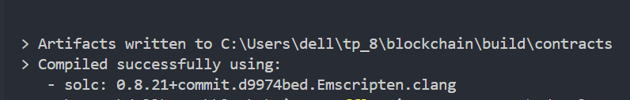
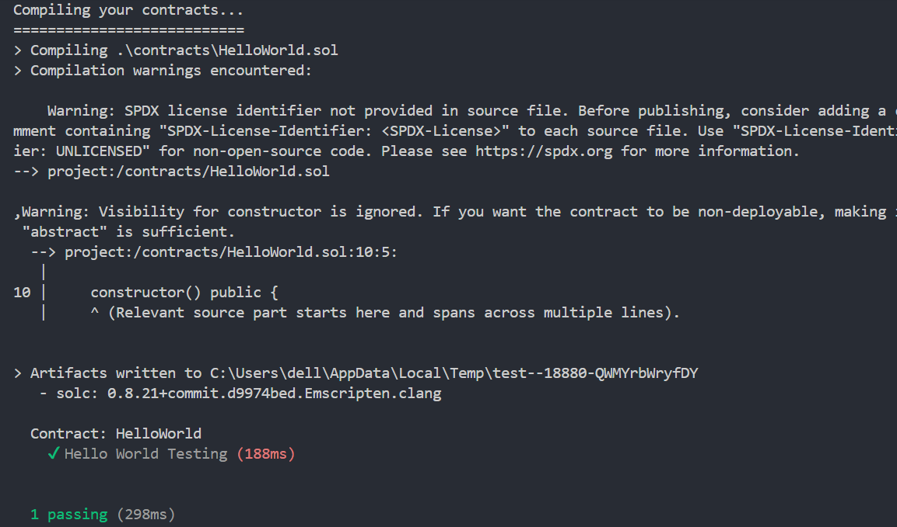
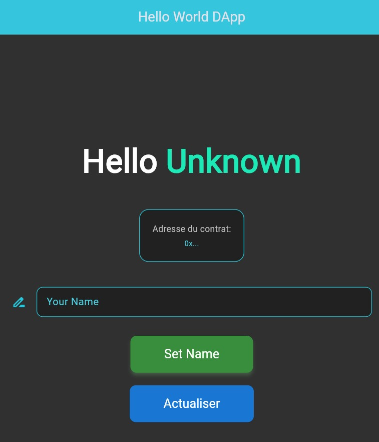
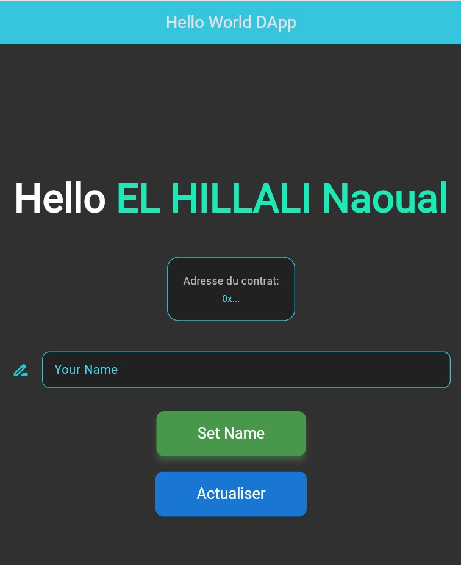

# TP 8 – Blockchain  
**NAOUAL ELHILLALI ADIA**  
**Group 1**

A Flutter project integrated with a blockchain smart contract using Truffle.

---

## Getting Started

This project demonstrates:
- Compilation of a smart contract with Truffle
- Migration of the smart contract
- Testing the contract
- Interaction with a Flutter DApp interface

---

## Capture d’écran – Compilation Truffle

---

## Capture d’écran – Migration Truffle

---

## Capture d’écran – Test du Smart Contract

---

## Capture d’écran – Interface DApp

---

## Capture d’écran – Affichage du nom

---

## Resources

- [Flutter – Write your first app](https://docs.flutter.dev/get-started/codelab)
- [Flutter Cookbook](https://docs.flutter.dev/cookbook)
- [Flutter Documentation](https://docs.flutter.dev/)
